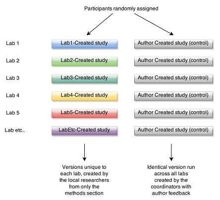

# ml4
Data and analysis scripts for the [Many Labs 4](https://osf.io/8ccnw/) project. The same mortality salience effect ([Greenberg et al., 1994; study 1](https://www.ncbi.nlm.nih.gov/pubmed/7965609)) was replicated in 20 independent labs. Half the labs designed their own replications without any feedback from original authors or other experts. The remaining half ran a version of the study designed with original author feedback. This was done by two different teams within the same university when possible. Data analysis focused on meta-analytic estimates of the overall effect size, and whether the different versions varied in their success obtaining the offect (with a particular eye towards whether original author feedback resulted in more successful replications). See more details and materials on the OSF page: [https://osf.io/8ccnw/](https://osf.io/8ccnw/).

# To use:

1. Install the latest version of **[R](https://cran.r-project.org/)**.
2. Install the latest version of **[R Studio](https://www.rstudio.com/products/rstudio/download/#download)**.
2. Download this repository to your computer by clicking the green "Clone or Download" button on the upper right of this page, download the .zip file and unzip it to anywhere on your hard drive. (Git savvy folks can instead fork and clone the repo if they wish - ask Rick if you want a demonstration).
3. You'll need the data (currently private due to confidentiality concerns). For now, e-mail Rick (raklein22@gmail.com) and he will send you the zipped data. Simply unzip that file into the ml4/data subdirectory.
4. Open the Projects file (.Rproj) **in R Studio**. [More info on the benefit of R Project files](https://support.rstudio.com/hc/en-us/articles/200526207-Using-Projects).
5. In R Studio, open the r script (.R) file you want to use. In this case the script files are: 
- **data_cleaning.R** which goes from raw site data to a single merged file
- **ml4analysis.R** which produces the statistical results
- **exp_survey_analysis.R** which analyzes data about the experimenters.
6. From here, you should be able to follow the R script from start to finish. The only edit you may have to make is to uncomment the 'install.packages()' lines to install the required packages.

Contact me if you have any issues/comments and I'll help work through them.
